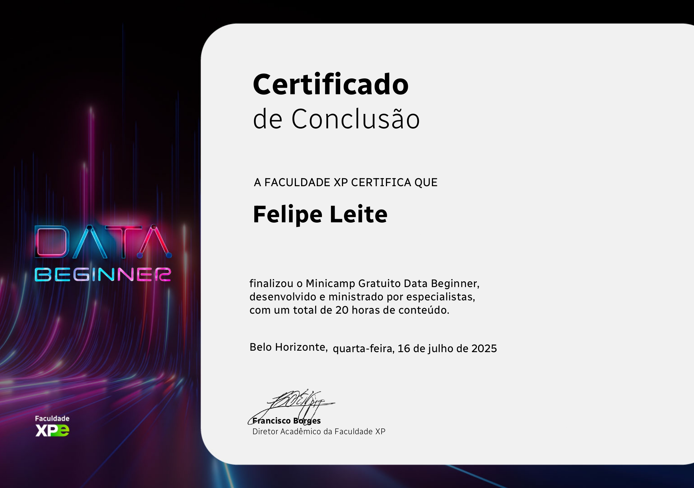
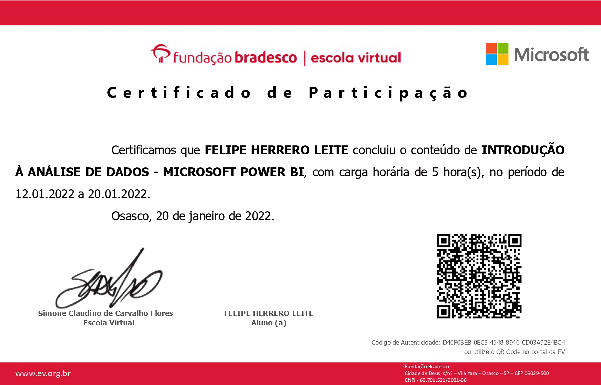
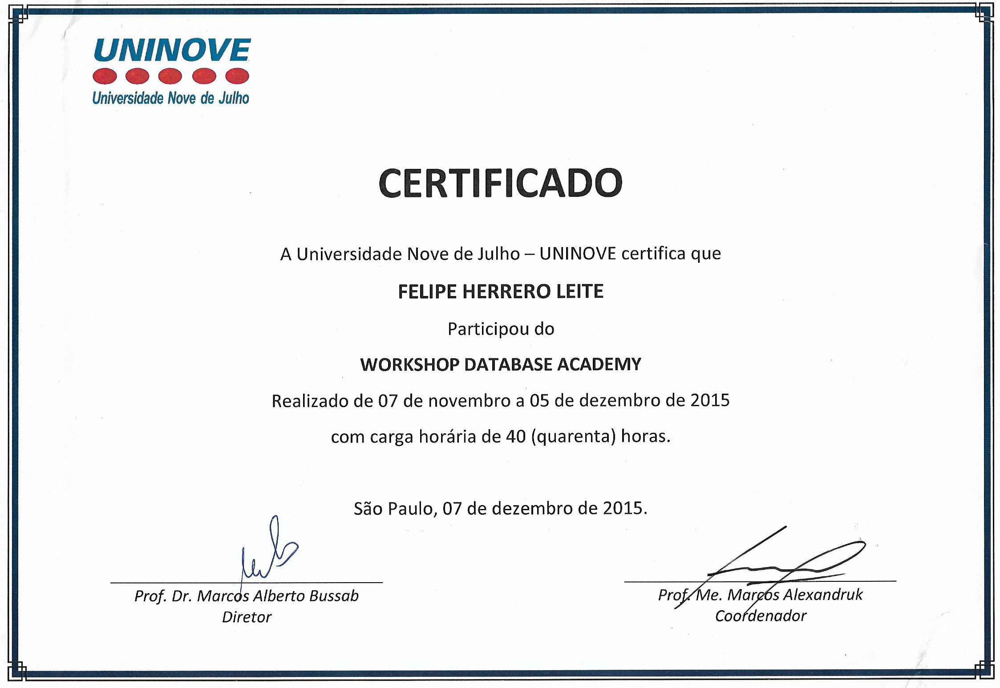
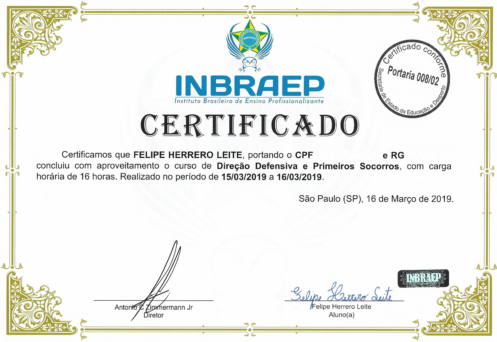
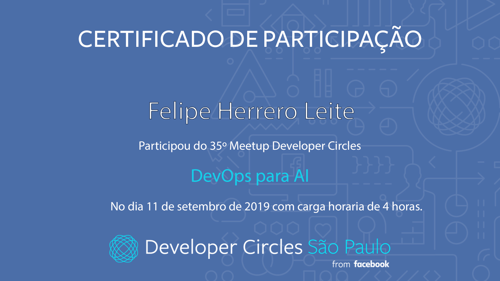
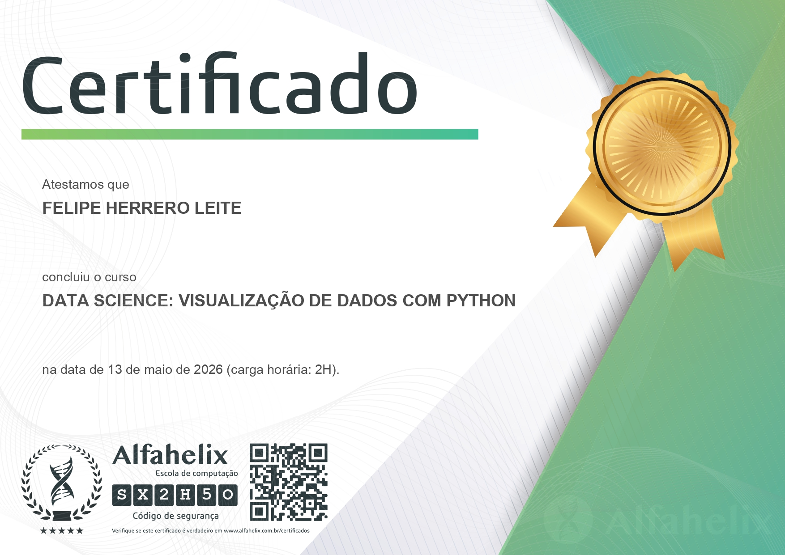

# Certificados

## Futura Cursos

Curso de Introdução à Informática

- Windows XP
- Word XP
- Excel XP
- PowerPoint XP
- Access XP
- Internet Explorer 6.0

📅 Conclusão: Outubro/2010  
⏱️ Carga horária: 96 horas

## Certificado

---

## Técnicas em Manutenção de Computadores

📅 Conclusão: Outubro/2010  
⏱️ Carga horária: 48 horas

### Conteúdo
- Manutenção de computadores
- Hardware
- Suporte técnico
- Diagnóstico básico

## Certificado

---

## Design Gráfico e Web Design

📅 Conclusão: 2010  
🏫 S.O.S Tecnologia e Educação Profissional

### Tecnologias estudadas
- Photoshop CS3
- Corel Draw X3
- InDesign CS3
- Fireworks 8
- Flash 8
- Dreamweaver 8
- Projetos de websites

## Certificado

---

## Minicamp Data Beginner

🏫 Faculdade XP  
📅 Julho/2025  
⏱️ 20 horas

### Conteúdo
- Fundamentos de dados
- Introdução à análise de dados
- Tecnologia aplicada a dados
- Analytics

## Certificado

---

## Introdução à Análise de Dados - Microsoft Power BI

🏫 Fundação Bradesco

### Conteúdo
- Power BI
- Visualização de dados
- Dashboards
- Business Intelligence
- Análise de dados

## Certificado

---

## Workshop Database Academy

🏫 UNINOVE

### Conteúdo
- Banco de dados
- Estrutura de dados
- Armazenamento de informações
- Tecnologia aplicada a dados

## Certificado

---

## Introdução ao Python

🏫 Prof. Diego Mariano

### Conteúdo
- Lógica de programação
- Python
- Variáveis
- Estruturas condicionais
- Fundamentos de programação

## Certificado

---

## Primeiros Socorros e Direção Defensiva

🏫 INBRAEP

### Conteúdo
- Primeiros socorros
- Atendimento inicial
- Segurança
- Direção defensiva
- Prevenção de acidentes

## Certificado

---

## DevOps para AI Developer

🏫 Developer Circles from Facebook

### Conteúdo
- DevOps
- Inteligência Artificial
- Automação
- Integração contínua
- Desenvolvimento moderno

## Certificado

---

# Formação Acadêmica

## Tecnólogo em Análise e Desenvolvimento de Sistemas

🏫 UNINOVE - Universidade Nove de Julho

### Principais áreas estudadas
- Desenvolvimento de Software
- Banco de Dados
- Lógica de Programação
- Desenvolvimento Web
- Flutter
- Python
- Power BI
- Tecnologia da Informação

## Diploma

# Certificados

## 🎓 Udemy

### Data Science: Visualização de Dados com Python

- Visualização de dados com Python
- Introdução ao Matplotlib
- Construção de gráficos
- Análise visual de dados

📅 Conclusão: 2026  
⏱️ Carga horária: 2h50

## 🖼️ Certificado

